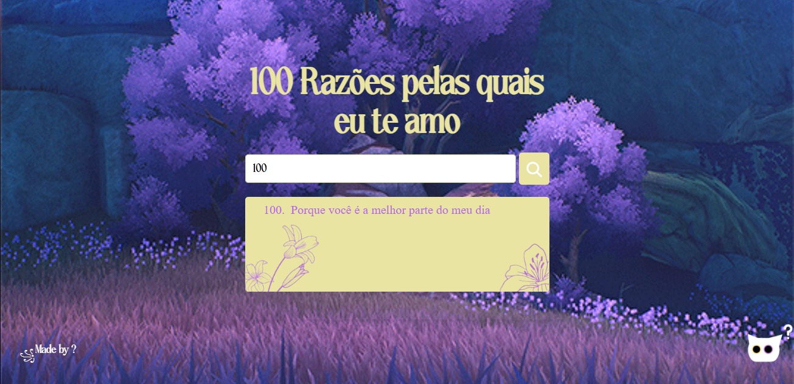

<h1 align=center>
   100 Razões Pelas Quais Eu Te Amo
</h1>

  
  <h4 align=left>
  Olá, esse foi o primeiro projeto por conta própria que fiz. Ele foi um "presente" 
  de 6 meses de namoro que eu fiz pra minha namorada, é bem parecido com aqueles  
  potinhos com post-its, mas a ideia aqui é a pessoa ver quando quiser, além de ter  
  animações e coisinhas fofas. No caso o código que vou postar aqui está em "branco"  
  por tanto as razões são genéricas e tirei o nome da minha namorada. Mas as imagens  
  são as que eu usei, mas elas podem ser mudadas também 
</h4>

 

<h2>
  Funcionamento
</h2>
<h4>
  Basicamente a pessoa vai digitar um número de 1 a 100 e o site vai retornar uma razão correspondente a esse número. Utilizei um array para armazenar as frases no JS e nele 
 também fiz a função que mostra o item escolhido, assim como também valida se o número é válido. Eu fiz uma alteração nessa parte que não aparece aqui, onde algumas razões 
 específicas mostravam imagens específicas, no caso, é só adcionar um else if no if que seleciona a frase e cria a div. Vou deixar uma imagem de exemplo
</h4>

  
  

  
<h2>
  Considerações
</h2>

  
  <h4 align=left>
  É um site fofo e simples, achei interessante deixar ele aqui não só pelo portfólio  
  mas também pra que outras pessoas possam usar quando quisem. Deixei também o "pet" que  
  eu fiz no site mas ele pode ser mudado também assim como qualquer outra imagem  
</h4>

